# Aruudy

[](https://kariminf.github.io/aruudy/)
[](http://www.apache.org/licenses/LICENSE-2.0)
[](https://pypi.python.org/pypi/aruudy)
[](https://pypi.org/project/aruudy/)
[](https://pypi.org/project/aruudy/)
[](https://travis-ci.org/kariminf/aruudy)
[](https://codecov.io/gh/kariminf/aruudy)
[](https://www.codefactor.io/repository/github/kariminf/aruudy/overview/master)
[](https://codebeat.co/projects/github-com-kariminf-aruudy-master)
[](https://codeclimate.com/github/kariminf/aruudy/)

Aruudy is a light library for Arabic prosody (Aruud) or "Science of Poetry".

[Test here](https://kariminf.github.io/aruudy/)

[web API: kariminf.pythonanywhere.com/](https://kariminf.pythonanywhere.com/)

## Notions

- **Verse [Bayt]**: (بيت) a line of poetry which is composed of two parts.
- **Hemistich [Shatr]**: (شطر) a part of a verse
- **Meter [Bahr]**: (بحر) The rhythme
- **Scansion [Wazn]**: (وزن) the weight of syllables, or the rhythmic structure
- **Foot [Tafiila]**: (تفعيلة) the rhythmic parts which compose the scansion

In Arabic scansion, we use two letters:
- "w": watad [peg] (وتد); it represents a vowelled letter
- "s": sabad [cord] (سبب); it represents an unvowelled letter

In english scansion, we use two characters:
- "u": short syllable;
- "-": long syllable

## Features

- bahr
    - Recover all meters (arabic name, english name, transliterated name)
    - Get the meters information by either its arabic or english names


- poetry
    - Information about Arabic poetery meters
    - Normalizing part (shatr) of a verse: delete tatweel, add forgotten diacretics
    - Writing the part into prosody form
    - Finding the arabic prosodic units "watad" and "sabab" based on haraka (vowel)
    - Finding the english prosodic units based on syllables
    - Detecting Arabic poetry meter
    - Affording feet types and the parts according to these feet


- web
    - API with flask
    - CGI (Common Gateway Interface) program


## Use

### Install

```
pip install aruudy
```

### Command line

#### List all available meters

```sh
aruudy [-l | --list] [a|e|t]
```
Will print the 16 meters names in
- Arabic if the option is "a"
- English if the option is "e"
- Transliteration if the option is "t"

For example:

```sh
aruudy -l a
```

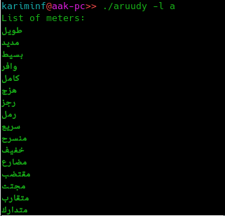

#### Get information about a meter

```sh
aruudy [-i, --info] <name>
```

The name can be in Arabic or in English.

Example:

```sh
aruudy -i long
```

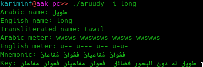

#### Get the meter of a Shatr (part of verse)

```sh
aruudy [-s, --shatr] <text>
```

Example:

```sh
aruudy -s "أَسِرْبَ القَطا هَلْ مَنْ يُعِيْرُ جَناحَهُ"
```

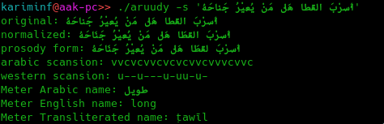

### Web Api

The api uses **flask** which must be installed. To test the api on your machine (locally), type:

```sh
aruudy_flask
```

This will create a server on **http://127.0.0.1:5000**.

The api has these request types:

#### $host/ls

Returns a json list with names of available Arabic poetry meters (16 meters).
The names are:
- arabic: Arabic names of the 16 meters
- english: English equivalent names
- trans: transliterated names

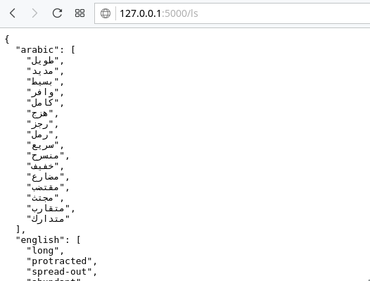

#### $host/info/[name]

Retrieve information about a meter by its name (arabic or english).
It returns a json object describing the meter (bahr).

- name: an object containing the different names of the meter
    - arabic: Arabic names of the 16 meters
    - english: English equivalent names
    - trans: transliterated names


- std_scansion and used_scansion: the standard scansion of the bahr, and the used one.
The two of them have the following elements:
    - ameter: meter used by Arabs as defined by Al-Khalil
    - emeter: the meter by syllables (European method)
    - mnemonic: the feet of the hemistich
    - type: the type of each foot


- key: a verse which describs the bahr

```
$host/info/long
```

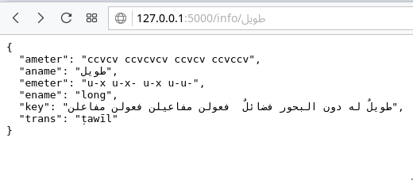

```
$host/info/complete
```

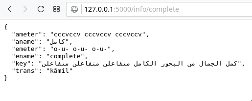

#### $host/shatr/[text]

Used to find the meter of the given text (a shatr: part of the verse). It returns a json object with these information:
- norm: the text normalized: no tatweel, fix some diacretics
- prosody: prosody writing (الكتابة العروضية) of the text
- ameter: the arabic meter of the text
- emeter: the english/european meter of the text
- bahr: the name of the bahr
    - if not found, it is a string "None"
    - if found, it is a json object with all the bahr's description

- parts: the text divided into parts accoding to the feet (as a list). each element is an object with the following information:
    - emeter: foot's english meter
    - mnemonic: foot's mnemonic
    - part: part of the text that fits the foot
    - type: the type of the foot

```
$host/shatr/فَـلا%20تَظُـنّـنّ%20أنّ%20اللّيْـثَ%20يَبْتَسِـمُ
```

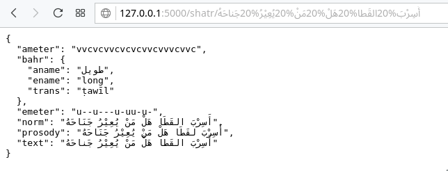

```
$host/shatr/فَـلا%20تَظُـنّـنّ%20أنّ
```

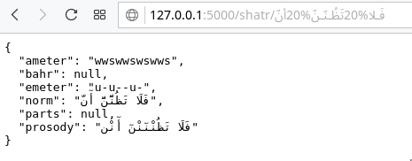

#### $host/shatr/[text]/[opt]

Same as **$host/shatr/[text]**, but you can choose which elements to include in the response by separating their names with a comma (","). If you ommit "bahr", it will return just the names of the meter and not all its information. Example:

```
$host/shatr/فَـلا%20تَظُـنّـنّ%20أنّ%20اللّيْـثَ%20يَبْتَسِـمُ/ameter
```
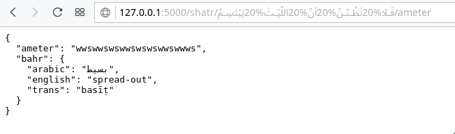

This will return the names of the meter with the texts arabic scansion.

If you want to include all elements and ommit some, you can put a minus in front of your options list. Example:

```
$host/shatr/فَـلا%20تَظُـنّـنّ%20أنّ%20اللّيْـثَ%20يَبْتَسِـمُ/-parts,bahr
```
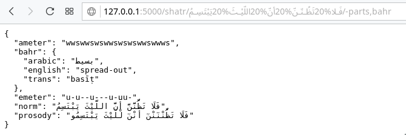

If you put "none", you will receive just the names of the meter.

```
$host/shatr/فَـلا%20تَظُـنّـنّ%20أنّ%20اللّيْـثَ%20يَبْتَسِـمُ/none
```
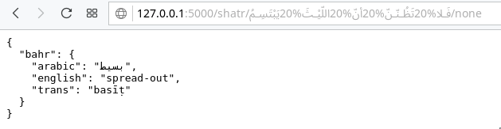

### Programming

Arabic poetry meter detection

```python
#!/usr/bin/env python
# -*- coding: utf-8 -*-

from aruudy.poetry import prosody

text = u'أَسِرْبَ القَطا هَلْ مَنْ يُعِيْرُ جَناحَهُ'

shatr = meter.process_shatr(text)

#Normalized text
print("normalized: " + shatr.norm)

#prosody form
print("prosody form: " + shatr.prosody)

# Farahidi meter for poetry
print("arabic scansion: " + shatr.ameter)

# Western-like metre
print("western scansion: " + shatr.emeter)

#get the bahr: it has aname, ename, trans,
b = shatr.bahr

```

You can process a text with sub-functions (without using **meter.process_shatr** which uses them all):
- **meter.normalize(text)**: returns a normalized text; deletes tatweel and fix some diacretics problems
- **meter.prosody_form(text)**: returns the prosody writing (الكتابة العروضية) of the text
- **meter.get_ameter(text)**: returns a string of arabic meter  with "v" as haraka "c" as sukuun

**TODO**: edit a full doc about the api

## Recommendations

To detect the meter, the poem's part must be fully vocalized (has diacritics).
To this end, It is recommended to use [Mishkal](https://github.com/linuxscout/mishkal)


## License
Copyright (C) 2014-2019 Abdelkrime Aries

Licensed under the Apache License, Version 2.0 (the "License");
you may not use this file except in compliance with the License.
You may obtain a copy of the License at

[http://www.apache.org/licenses/LICENSE-2.0](http://www.apache.org/licenses/LICENSE-2.0)

Unless required by applicable law or agreed to in writing, software
distributed under the License is distributed on an "AS IS" BASIS,
WITHOUT WARRANTIES OR CONDITIONS OF ANY KIND, either express or implied.
See the License for the specific language governing permissions and
limitations under the License.
